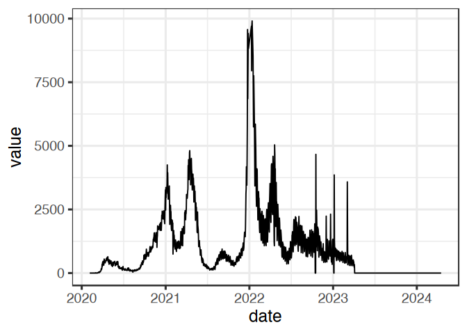
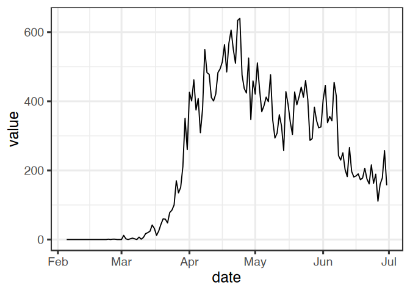
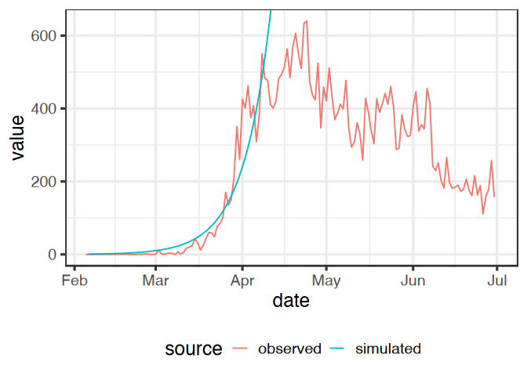
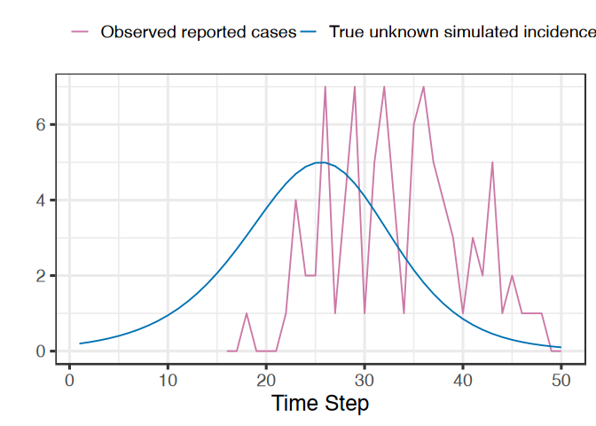
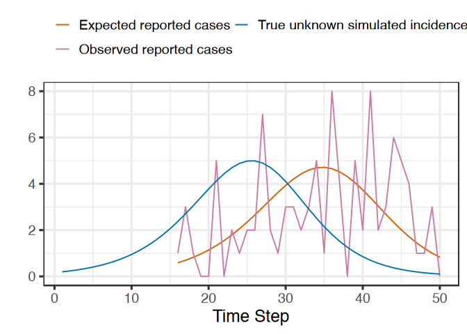
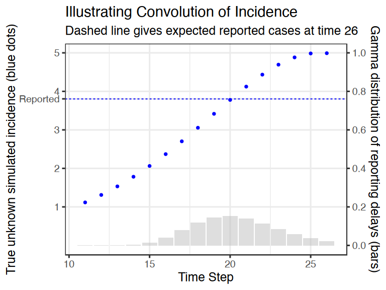
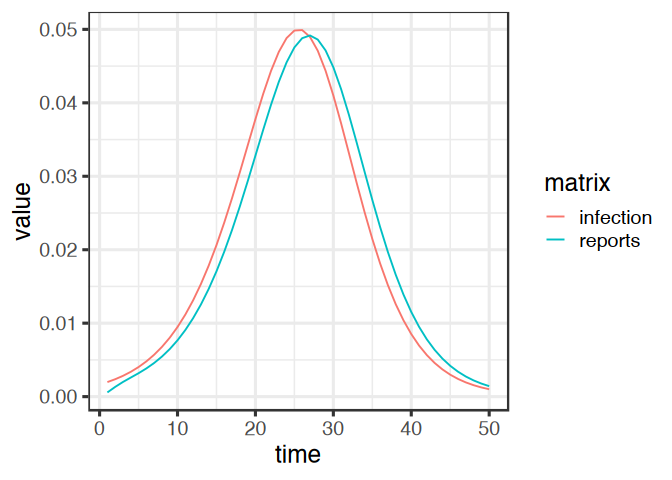

Workshop on `macpan2` – Companion Materials
================

Author: [Steve Walker](https://github.com/stevencarlislewalker)

Last Updated: 2025-01-10

[](http://creativecommons.org/licenses/by-nc-sa/4.0/)

This is a (currently draft) set of companion materials for a workshop on
using [`macpan2`](https://canmod.github.io/macpan2) for applied public
health modelling.

(Note: I highlight areas that cannot be finalized yet, with notes like
this)

<!-- omit from toc -->

## Table of Contents

-   [Preliminaries](#preliminaries)
    -   [Syllabus](#syllabus)
    -   [Philosophy](#philosophy)
    -   [Organization](#organization)
    -   [Code Style](#code-style)
    -   [Dependencies](#dependencies)
-   [Exploration](#exploration)
    -   [Starter Model Library](#starter-model-library)
    -   [Simulating Dynamics](#simulating-dynamics)
    -   [Relating Model Specifications to Box
        Diagrams](#relating-model-specifications-to-box-diagrams)
    -   [Relating Model Specifications to Explicit
        Dynamics](#relating-model-specifications-to-explicit-dynamics)
    -   [Basics of Modifying Model
        Specifications](#basics-of-modifying-model-specifications)
    -   [Compare Simulated and Observed
        Incidence](#compare-simulated-and-observed-incidence)
    -   [Reporting Delays](#reporting-delays)
    -   [Hospital Admissions and
        Occupancy](#hospital-admissions-and-occupancy)
    -   [Symptom Status](#symptom-status)
    -   [Seroprevalence](#seroprevalence)
    -   [Vaccination](#vaccination)
    -   [Wastewater Pathogen
        Concentrations](#wastewater-pathogen-concentrations)
    -   [Vital Dynamics](#vital-dynamics)
    -   [Importation and Stochasticity](#importation-and-stochasticity)
-   [Parameterization](#parameterization)
    -   [Modify Default Values](#modify-default-values)
    -   [Express Uncertainty in Model
        Parameters](#express-uncertainty-in-model-parameters)
    -   [Optimized Calibration](#optimized-calibration)
    -   [MAP Estimation](#map-estimation)
    -   [Likelihood and Prior Distribution
        Assumptions](#likelihood-and-prior-distribution-assumptions)
    -   [Can I hack `macpan2` to use MCMC
        esimation?](#can-i-hack-macpan2-to-use-mcmc-esimation)
    -   [Calibrating Time-Varying
        Parameters](#calibrating-time-varying-parameters)
-   [Inference](#inference)
    -   [Assessing Model Fits](#assessing-model-fits)
    -   [Forecasts](#forecasts)
    -   [Counter-Factuals](#counter-factuals)
    -   [Reproduction Numbers of Generation Interval
        Distributions](#reproduction-numbers-of-generation-interval-distributions)
-   [Stratification](#stratification)

## Preliminaries

### Syllabus

Please read the
[syllabus](https://canmod.github.io/macpan-workshop/syllabus) before
participating in this workshop. The instructor will review this syllabus
with participants before the sessions start.

MLi: I would like a visualization of the roadmap. 

The syllabus provides a roadmap for the workshop, guiding participants
through the exploration-parameterization-inference-stratification
strategy essential for compartmental modeling using the `macpan2`
package. Each session is organized around these steps, offering a
structured approach to model refinement. Participants will follow a
practical example that demonstrates each phase of the strategy, with
companion materials available for deeper exploration of related skills.
Each session contains exercises designed to reinforce key concepts and
encourage participants to apply lessons to their own compartmental model
diagrams. For those without a pre-existing model or whose models are not
applicable, a detailed example model is provided to ensure a hands-on
learning experience. By the end of the workshop, participants will have
the skills to evaluate the suitability of compartmental modeling for
public health problems, develop models using macpan2, navigate its
documentation to address challenges, and provide constructive feedback
for improving the tool.


MLi: We need to straight out the end goal of the workshop, what do we want people to get out of it? For me, I would like people to bring in a model and they can walk out with a macpan2 implementation of the model they bring in. 

MLi: Given it is in-person, I would like a bit of interactive discussions. For example, we can do a brainstorming session of what people want based on their experience and challenges with their own models. We will list all of them and then SW can go through 1 at a time as a group and say, we can do this in macpan2 or we can't do it. This will give us an idea about future developments. 

### Philosophy

The goal of `macpan2` is *not* to implement cutting edge modelling and
statistical techniques. Instead the goal is to implement well-understood
techniques, optimized for use by epidemiologists who are tasked with
answering real-world public health questions using data-calibrated
compartmental models.

### Organization

Our effort to present standard tools in a convenient manner has led us
to develop concepts that encapsulate how I believe modellers do (or
should) think. By building and updating our software with these concepts
in mind, I seek to converge on a tool that will help modellers focus
more on epidemiology and less on computational details. We highlight
these concepts in special boxes.

|                                                                                                                                         |
|:------------------------------------------------------------------------------------------------------------------------------------------------------------------------------------|
| **User Feedback**<br>Our modelling concepts are hypotheses that I would like feedback on. What concepts seem helpful/useful and what concepts seem harmful/useless? |

MLi: Do we have a good way to get feedbacks and not via email to SW?


Ideally these concepts would lead to a perfectly intuitive tool. In
reality I recognize that there are important technical details that you
will need to learn to use the tool effectively. We try to collect the
more technical ideas in tip boxes.

|                                                                                              |
|:-------------------------------------------------------------------------------------------------------------------------------------|
| Tip boxes like this contain technical information that could interrupt the flow of ideas, but is too important to bury in footnotes. |

If you’re attending this workshop, you’re already a highly skilled
modeller. Many of the concepts will be familiar to you, so you may gain
more by actively engaging with the tool itself. To support this process
of self-discovery, I have designed a series of exercises.

|                                                                                                                                                                                                                                                                  |
|:--------------------------------------------------------------------------------------------------------------------------------------------------------------------------------------------------------------------------------------------------------------------------------------------------------------|
| For your first exercise, please familiarize yourself with the package website: <https://canmod.github.io/macpan2>. Pay particular attention to the [quickstart guide](https://canmod.github.io/macpan2/quickstart) and other [user guides](https://canmod.github.io/macpan2/articles/index.html#user-guides). |

### Code Style

Throughout these materials I will repeatedly use several coding idioms.
Please familiarize yourself with these in advance of the workshop.

We will often use the [base R pipe
operator](https://www.tidyverse.org/blog/2023/04/base-vs-magrittr-pipe/#pipes),
`|>`, when it improves readability.

MLi: We need to identify what is really necessary vs recommended. People can still use macpan2 without pipes right?

### Dependencies

The `macpan2` package is designed to be used with two other standard
packages, and so all of the code in these materials assumes that the
following packages are loaded.

``` r
library(macpan2) ## obviously
library(ggplot2)
library(dplyr)
library(lubridate)
```

This document was produced with the following R environment.

``` r
sessionInfo() |> print()
```

    ## R version 4.4.2 (2024-10-31)
    ## Platform: x86_64-apple-darwin20
    ## Running under: macOS Sequoia 15.0.1
    ## 
    ## Matrix products: default
    ## BLAS:   /Library/Frameworks/R.framework/Versions/4.4-x86_64/Resources/lib/libRblas.0.dylib 
    ## LAPACK: /Library/Frameworks/R.framework/Versions/4.4-x86_64/Resources/lib/libRlapack.dylib;  LAPACK version 3.12.0
    ## 
    ## locale:
    ## [1] en_CA.UTF-8/en_CA.UTF-8/en_CA.UTF-8/C/en_CA.UTF-8/en_CA.UTF-8
    ## 
    ## time zone: America/New_York
    ## tzcode source: internal
    ## 
    ## attached base packages:
    ## [1] stats     graphics  grDevices utils     datasets  methods   base     
    ## 
    ## other attached packages:
    ## [1] lubridate_1.9.3 dplyr_1.1.4     ggplot2_3.5.1   macpan2_1.13.0 
    ## 
    ## loaded via a namespace (and not attached):
    ##  [1] vctrs_0.6.5       cli_3.6.3         knitr_1.49        rlang_1.1.4      
    ##  [5] xfun_0.49         generics_0.1.3    jsonlite_1.8.9    glue_1.8.0       
    ##  [9] colorspace_2.1-1  TMB_1.9.15        htmltools_0.5.8.1 fansi_1.0.6      
    ## [13] scales_1.3.0      rmarkdown_2.29    grid_4.4.2        tibble_3.2.1     
    ## [17] evaluate_1.0.1    munsell_0.5.1     MASS_7.3-61       fastmap_1.2.0    
    ## [21] yaml_2.3.10       lifecycle_1.0.4   memoise_2.0.1     compiler_4.4.2   
    ## [25] timechange_0.3.0  pkgconfig_2.0.3   lattice_0.22-6    digest_0.6.37    
    ## [29] R6_2.5.1          tidyselect_1.2.1  utf8_1.2.4        oor_0.0.2        
    ## [33] pillar_1.9.0      magrittr_2.0.3    Matrix_1.7-1      withr_3.0.2      
    ## [37] tools_4.4.2       gtable_0.3.6      cachem_1.1.0

## Exploration

Participants will learn how to explore and modify models, and informally
compare them with observed data.

MLi: We will have to also prepare for folks without a model/data. If this is the case, I was like to promote IIDDA. We can say, if you want have data or model, here is a very cool database we compiled. If you are interested in reading more, go here for the preprint. 

At the core of macpan2 are model specifications, which primarily define
the flows between compartments and set default values for parameters.
These specifications offer a clear and systematic way to describe the
behavior of a system, starting with the foundational elements of
compartmental models. While additional complexities, such as vital
dynamics, external sources and sinks, or initialization of state
variables, are often necessary, I begin with simple specifications.

|                                                                                                                                                                                                                                                                                                                                                                                                                                                                                                                                                                                                                                                                                |
|:---------------------------------------------------------------------------------------------------------------------------------------------------------------------------------------------------------------------------------------------------------------------------------------------------------------------------------------------------------------------------------------------------------------------------------------------------------------------------------------------------------------------------------------------------------------------------------------------------------------------------------------------------------------------------------------------------------------------------|
| **Parsimony**<br>Starting with simplicity reflects an essential modelling principle: begin with a straightforward model and gradually add complexity as the situation demands, whether for specific data, additional details, or particular public health objectives. This approach will help you quickly get started with macpan2 and transition smoothly to more intricate applications. It also highlights the value of abstract compartmental models that can be stored in a library of reusable templates. These templates can be adapted to different scenarios, allowing for efficient modelling tailored to public health challenges.<br><br>TODO: link to model modification section. |

### Starter Model Library

Throughout the workshop, I provide you with starting points that take
care of much of the boilerplate, enabling you to concentrate on the
unique aspects of your applications. For instance, you will explore a
library of dynamical models, identify simple specifications, and see how
they define flows and default parameter values. Hands-on exercises will
guide you to experiment with these models, helping you uncover their
structure and applications in a variety of public health contexts.

To list available models in the macpan2 library, use the following
command:

``` r
show_models()
```

| Directory                                                                                                                    | Title                    | Description                                                                                                     |
|:-----------------------------------------------------------------------------------------------------------------------------|:-------------------------|:----------------------------------------------------------------------------------------------------------------|
| [awareness](https://github.com/canmod/macpan2/tree/main/inst/starter_models/awareness)                                       | Awareness Models         | Behaviour modifications in response to death                                                                    |
| [hiv](https://github.com/canmod/macpan2/tree/main/inst/starter_models/hiv)                                                   | HIV                      | A simple HIV model                                                                                              |
| [lotka_volterra_competition](https://github.com/canmod/macpan2/tree/main/inst/starter_models/lotka_volterra_competition)     | Lotka-Volterra           | Simple two-species competition model                                                                            |
| [lotka_volterra_predator_prey](https://github.com/canmod/macpan2/tree/main/inst/starter_models/lotka_volterra_predator_prey) | Lotka-Volterra           | Simple predator-prey model                                                                                      |
| [macpan_base](https://github.com/canmod/macpan2/tree/main/inst/starter_models/macpan_base)                                   | Macpan Base              | Re-implementation of the McMaster group’s COVID-19 model                                                        |
| [nfds](https://github.com/canmod/macpan2/tree/main/inst/starter_models/nfds)                                                 | NFDS and Vaccine Design  | An ecological model using population genomics to design optimal vaccines as implemented in Colijn et al. (2020) |
| [seir](https://github.com/canmod/macpan2/tree/main/inst/starter_models/seir)                                                 | Basic SEIR               | Simple epidemic model with an exposed class                                                                     |
| [shiver](https://github.com/canmod/macpan2/tree/main/inst/starter_models/shiver)                                             | SHIVER = SEIR + H + V    | A modified SEIR model with Hospitalization and Vaccination                                                      |
| [si](https://github.com/canmod/macpan2/tree/main/inst/starter_models/si)                                                     | Basic SI                 | A very simple epidemic model                                                                                    |
| [sir](https://github.com/canmod/macpan2/tree/main/inst/starter_models/sir)                                                   | Basic SIR                | A very simple epidemic model                                                                                    |
| [sir_demog](https://github.com/canmod/macpan2/tree/main/inst/starter_models/sir_demog)                                       | SIR with Demography      | An SIR model with birth and death                                                                               |
| [sir_mosquito](https://github.com/canmod/macpan2/tree/main/inst/starter_models/sir_mosquito)                                 | Mosquito-Vector SIR      | SIR model for mosquito vectors                                                                                  |
| [sir_waning](https://github.com/canmod/macpan2/tree/main/inst/starter_models/sir_waning)                                     | SIR with Waning Immunity | A basic SIR model with a flow from R back to S                                                                  |
| [ww](https://github.com/canmod/macpan2/tree/main/inst/starter_models/ww)                                                     | Wastewater Model         | Macpan base with an additional wastewater component                                                             |

This function displays the available models, along with their
directories, titles, and descriptions.

To examine a specific model, such as the SIR model, load it into R:

``` r
sir = mp_tmb_library("starter_models", "sir", package = "macpan2")
print(sir)
```

    ## ---------------------
    ## Default values:
    ## ---------------------
    ##  quantity value
    ##      beta   0.2
    ##     gamma   0.1
    ##         N 100.0
    ##         I   1.0
    ##         R   0.0
    ## 
    ## ---------------------
    ## Before the simulation loop (t = 0):
    ## ---------------------
    ## 1: S ~ N - I - R
    ## 
    ## ---------------------
    ## At every iteration of the simulation loop (t = 1 to T):
    ## ---------------------
    ## 1: mp_per_capita_flow(from = "S", to = "I", rate = "beta * I / N", 
    ##      abs_rate = "infection")
    ## 2: mp_per_capita_flow(from = "I", to = "R", rate = "gamma", abs_rate = "recovery")

There are three parts to this specification.

-   **Default values:** The default values that model quantities take
    before each simulation begins[^1]. In the `sir` example there are
    two parameters, `beta` and `gamma`, the total population size, `N`,
    and the initial values of two state variables, `I` and `R`.
-   **Before the simulation loop:** Expressions that get evaluated by
    `macpan2` before the dynamical simulation loop. In the `sir` example
    the initial value of `S` is computed. Note that the specification
    could have placed `S` in the defaults, but as we will see the choice
    of whether to (1) place the initial value of a quantity in the
    defaults or (2) compute it in `macpan2` before the simulation loop
    begins will depend on a number of considerations.
-   **At every iteration of the simulation loop:** Expressions that get
    evaluated iteratively during the simulation loop. In the `sir`
    example there are two flows, which I discuss more throughout the
    next few sections.

|                                                                                                                                                                                                                                                                                                                                                                                                                                                                                                                                                                                                                                                                                                                                                                                                                                                                                                                                                           |
|:--------------------------------------------------------------------------------------------------------------------------------------------------------------------------------------------------------------------------------------------------------------------------------------------------------------------------------------------------------------------------------------------------------------------------------------------------------------------------------------------------------------------------------------------------------------------------------------------------------------------------------------------------------------------------------------------------------------------------------------------------------------------------------------------------------------------------------------------------------------------------------------------------------------------------------------------------------------------------------------------------|
| Model specification objects, like `sir` above, can be produced using several different functions. Above I produced such an object using `mp_tmb_library()`, which reads pre-existing specifications in from the library. If you were to go the [directory](https://github.com/canmod/macpan2/tree/main/inst/starter_models/sir) that defines this library model you would see [the script](https://github.com/canmod/macpan2/blob/main/inst/starter_models/sir/tmb.R) that actually produces the specification. This script uses the `mp_tmb_model_spec()` function to do so, and you can use this function directly yourself to produce your own model specifications. Later we will learn about other functions that take a model specification and return a modified version of this specification. This is useful when a model needs to be modified so that it can be compared with data (e.g., account for under-reporting, time-varying transmission rates in response to school closures). |

|                                                                                                                                                                                                                                                                                                                                                                                                                                                                                                                                                                                                                                                                                                                                                                                                                                                       |
|:----------------------------------------------------------------------------------------------------------------------------------------------------------------------------------------------------------------------------------------------------------------------------------------------------------------------------------------------------------------------------------------------------------------------------------------------------------------------------------------------------------------------------------------------------------------------------------------------------------------------------------------------------------------------------------------------------------------------------------------------------------------------------------------------------------------------------------------------------------------------------------------------|
| The `sir` model illustrates the two kinds of expressions that can be used to define model behaviour: (1) Generic math expressions (e.g., `S ~ N - I - R`) and (2) flows among compartments (e.g., `mp_per_capita_flows(from ...)`). In generic math expressions, the tilde, `~`, is used to denote assignment. For example, the expression, `S ~ N - I - R`, says that the result of `N - I - R` is assigned to the quantity, `S`. Any function listed [here](https://canmod.github.io/macpan2/reference/engine_functions) can be used on the right-hand-side of these expressions. Each flow expression corresponds to a single flow between compartments. The tilde-based math expressions and flow expressions can be mixed to provide a great deal of flexibility in model specifications. Throughout I will discuss the relative advantages and disadvantages of using one or the other. |

MLi: I personally don't like this order. I would probably start with showing how to implement an SIR and then be like oh yeah, we have a bunch of templates where we already coded some of the commonly used models. It would be great to show the manual implementation matching up with the boilerplate. 


### Simulating Dynamics

The main thing that you will do with model specifications like `sir` is
to simulate dynamics under these models. Because specifications come
with default values for parameters and initial states, they can be
simulated from without any further specification. This does not mean
that model library specifications will typically be ready for any
particular application without modification, and I will discuss many
types of modifications that can be made to these models today. However,
typically the first thing to do when given a new model is to simulate
from it, so you develop this skill immediately.

|                                                                                                     |
|:-------------------------------------------------------------------------------------------------------------------------------------------------|
| Follow this [quick-start guide](https://canmod.github.io/macpan2/articles/quickstart) to simulate from the `sir` model using its default values. |

|                                                                                                                                                                                                                                                                                                                                                                                                                                                                                                                                                                                                                                                                                   |
|:------------------------------------------------------------------------------------------------------------------------------------------------------------------------------------------------------------------------------------------------------------------------------------------------------------------------------------------------------------------------------------------------------------------------------------------------------------------------------------------------------------------------------------------------------------------------------------------------------------------------------------------------------------------------------------------------------------------------------|
| **Simple, Consistent, and General Format for Simulation Output**<br>Simulations of `macpan2` models are always returned in the same format – there are no options. This inflexibility is deliberate. The simulation data format is simple and easily adapted to whatever data organizational preferences you might have. This choice also benefits us because it means we do not need to worry about reinventing data preparation tools (many of which already exist) and focus on epidemiological modelling functionality (of which fewer options exist). [This](https://canmod.github.io/macpan2/articles/quickstart#generating-simulations) article gives a brief but full description of the data format. |

MLi: Page not found. Unless quickstart shows how to manually make an SIR, I am not comfortable with the current flow. I don't like the idea of right off the bat you use the template. Don't get me wrong, for an user that is probably the case, but for teaching, I would like a manual implementation first.  

### Relating Model Specifications to Box Diagrams

Model specification objects, such as the `sir` object produced in the
previous section, are essentially textual descriptions of compartmental
model flow diagrams. Below I print out the *during the simulation loop*
portion of the `sir` object, and plot the corresponding flow diagram,
highlighting the relationship between the two.

``` r
mp_print_during(sir)
```

    ## ---------------------
    ## At every iteration of the simulation loop (t = 1 to T):
    ## ---------------------
    ## 1: mp_per_capita_flow(from = "S", to = "I", rate = "beta * I / N", 
    ##      abs_rate = "infection")
    ## 2: mp_per_capita_flow(from = "I", to = "R", rate = "gamma", abs_rate = "recovery")

<!-- -->

|                                                                                                                                                                                                                 |
|:-------------------------------------------------------------------------------------------------------------------------------------------------------------------------------------------------------------------------------------------------------------|
| Identify how each aspect of the diagram (compartments, arrows, rates) are represented in the printout of the model specification.<br><br>Inspect the model specification again. What questions do you have about each part of the specification? |

### Relating Model Specifications to Explicit Dynamics

One aspect of the previous model printout that might be unclear to you
is the specific mathematical meaning of the `mp_per_capita_flow`
functions, and their arguments.

``` r
mp_print_during(sir)
```

    ## ---------------------
    ## At every iteration of the simulation loop (t = 1 to T):
    ## ---------------------
    ## 1: mp_per_capita_flow(from = "S", to = "I", rate = "beta * I / N", 
    ##      abs_rate = "infection")
    ## 2: mp_per_capita_flow(from = "I", to = "R", rate = "gamma", abs_rate = "recovery")

The technical documentation for this (and related) functions is
[here](https://canmod.github.io/macpan2/reference/mp_per_capita_flow),
but the following set of definitions summarizes the terminology.

|                                                                                                                                                                                                                                                                                                                                                                                                                                                                                                                                                                                                                                                                                                                                                                                                                                                                                                                                                                                                                                                                                                                                                                                                                                                                                                                                                                                                                                                                                                                                                                                                      |
|:----------------------------------------------------------------------------------------------------------------------------------------------------------------------------------------------------------------------------------------------------------------------------------------------------------------------------------------------------------------------------------------------------------------------------------------------------------------------------------------------------------------------------------------------------------------------------------------------------------------------------------------------------------------------------------------------------------------------------------------------------------------------------------------------------------------------------------------------------------------------------------------------------------------------------------------------------------------------------------------------------------------------------------------------------------------------------------------------------------------------------------------------------------------------------------------------------------------------------------------------------------------------------------------------------------------------------------------------------------------------------------------------------------------------------------------------------------------------------------------------------------------------------------------------------------------------------------------------------------------------------------------------------|
| **Absolute flow rate:** Total number of individuals flowing from one compartment to another in a single time-step. We call absolute flows things like `infection` and `recovery`. These names specified using the `abs_rate` argument in the [mp_per_capita_flow()](https://canmod.github.io/macpan2/reference/mp_per_capita_flow) function. The numerical value of the absolute flow rate depends on the *per-capita flow rate*, but in a way that depends on the *state update method*.<br><br>**Per-capita flow rate**: The rate at which individuals flow from one compartment to another in a single time-step, per individual in the source compartment. For example, the per-capita infection rate is often given by `beta * I / N` and for recovery is often `gamma`. These expressions are specified using the `rate` argument of the `mp_per_capita_rate` function.<br><br>**State update method**: Mathematical framework for computing *absolute flow rates* from *per-capita flow rates*. For example, the difference equation (a.k.a. Euler ODE solver, [mp_euler()](https://canmod.github.io/macpan2/reference/state_updates)) state update method results in `infection = S * (beta * I / N)`, with the *per-capita flow rate* in parentheses. For the state update method using the Runge-Kutta 4 ODE solver ([mp_rk4()](https://canmod.github.io/macpan2/reference/state_updates)), the relationship between *absolute flow rates* and *per-capita flow rates* is more complex because it accounts (to some extent) for the fact that the state variables change continuously through a single time step. |

Now that these definitions are in place, let’s look at an example. One
can use the
[mp_expand()](https://canmod.github.io/macpan2/reference/mp_expand)
function to expand the `mp_per_capita_flow()` notation to an explicit
form that is passed to the simulation engine.

``` r
sir |> mp_print_during()
```

    ## ---------------------
    ## At every iteration of the simulation loop (t = 1 to T):
    ## ---------------------
    ## 1: mp_per_capita_flow(from = "S", to = "I", rate = "beta * I / N", 
    ##      abs_rate = "infection")
    ## 2: mp_per_capita_flow(from = "I", to = "R", rate = "gamma", abs_rate = "recovery")

``` r
sir |> mp_expand() |> mp_print_during()
```

    ## ---------------------
    ## At every iteration of the simulation loop (t = 1 to T):
    ## ---------------------
    ## 1: infection ~ S * (beta * I/N)
    ## 2: recovery ~ I * (gamma)
    ## 3: S ~ S - infection
    ## 4: I ~ I + infection - recovery
    ## 5: R ~ R + recovery

This output illustrates that the (default) simulation framework is a
discrete time system of difference equations. In the first two
expressions in the expanded version the absolute flow rates are
computed, which are used in the last three expressions to update the
state variables.

For another example, suppose you are more comfortable with treating
compartmental models as ODEs. Indeed many modellers read the SIR flow
diagram as representing this specific set of ODEs.

$$
\begin{align}
\frac{dS}{dt} & = -S \times \beta I / N \\
\frac{dI}{dt} & = -I \times \gamma + S \times \beta I / N \\
\frac{dR}{dt} & = I \times \gamma \\
\end{align}
$$


MLi: Expand text why one would want to use ODE. For example, people are used to it... bla bla bla

We can easily use the `sir` compartmental model object to simulate it as
an ODE using the `mp_rk4()` function, which uses the [Runge Kutta 4 ODE
solver](https://en.wikipedia.org/wiki/Runge%E2%80%93Kutta_methods).

``` r
sir |> mp_rk4() |> mp_expand() |> mp_print_during()
```

    ## ---------------------
    ## At every iteration of the simulation loop (t = 1 to T):
    ## ---------------------
    ##  1: k1_infection ~ S * (beta * I/N)
    ##  2: k1_recovery ~ I * (gamma)
    ##  3: k1_S ~ -k1_infection
    ##  4: k1_I ~ +k1_infection - k1_recovery
    ##  5: k1_R ~ +k1_recovery
    ##  6: k2_infection ~ (S + (k1_S/2)) * (beta * (I + (k1_I/2))/N)
    ##  7: k2_recovery ~ (I + (k1_I/2)) * (gamma)
    ##  8: k2_S ~ -k2_infection
    ##  9: k2_I ~ +k2_infection - k2_recovery
    ## 10: k2_R ~ +k2_recovery
    ## 11: k3_infection ~ (S + (k2_S/2)) * (beta * (I + (k2_I/2))/N)
    ## 12: k3_recovery ~ (I + (k2_I/2)) * (gamma)
    ## 13: k3_S ~ -k3_infection
    ## 14: k3_I ~ +k3_infection - k3_recovery
    ## 15: k3_R ~ +k3_recovery
    ## 16: k4_infection ~ (S + k3_S) * (beta * (I + k3_I)/N)
    ## 17: k4_recovery ~ (I + k3_I) * (gamma)
    ## 18: k4_S ~ -k4_infection
    ## 19: k4_I ~ +k4_infection - k4_recovery
    ## 20: k4_R ~ +k4_recovery
    ## 21: infection ~ (k1_infection + 2 * k2_infection + 2 * k3_infection + k4_infection)/6
    ## 22: recovery ~ (k1_recovery + 2 * k2_recovery + 2 * k3_recovery + k4_recovery)/6
    ## 23: S ~ S - infection
    ## 24: I ~ I + infection - recovery
    ## 25: R ~ R + recovery

|                                                                                                                                                                                                                                                                                                                                                                                                                                                                                                                                                                                                                                                                                                                        |
|:-------------------------------------------------------------------------------------------------------------------------------------------------------------------------------------------------------------------------------------------------------------------------------------------------------------------------------------------------------------------------------------------------------------------------------------------------------------------------------------------------------------------------------------------------------------------------------------------------------------------------------------------------------------------------------------------------------------------------------------------------------------------|
| **Mix and Match Compartmental Models with State Update Methods**<br>Difference equations and ODEs are the two most common [state update methods](https://canmod.github.io/macpan2/reference/state_updates) for simulating a compartmental model. The design of `macpan2` allows different state update methods to be mixed and matched with different compartmental model specifications. This flexible modularity is a key part of the power of `macpan2` – the model specification language is agnostic about the state update method. Therefore each compartmental model can be simulated in any number of ways. The full list of currently available state update methods is [here](https://canmod.github.io/macpan2/reference/state_updates). |

Here is one more example of an SIR model expansion that uses the
[Euler-multinomial
distribution](https://kingaa.github.io/manuals/pomp/html/eulermultinom.html)
to simulate a compartmental model with process error.

MLi: Write a bit more text. Why do people want it and why is it good to include it. I know we are not teaching why people epi/modelling, but I feel like a few extra lines talking through some points can help instead the current version just saying "use this".  

``` r
sir |> mp_euler_multinomial() |> mp_expand() |> mp_print_during()
```

    ## ---------------------
    ## At every iteration of the simulation loop (t = 1 to T):
    ## ---------------------
    ## 1: infection ~ reulermultinom(S, (beta * I/N))
    ## 2: recovery ~ reulermultinom(I, gamma)
    ## 3: S ~ S - infection
    ## 4: I ~ I + infection - recovery
    ## 5: R ~ R + recovery

Note that all [state update
methods](https://canmod.github.io/macpan2/reference/state_updates)
generate the same last three expressions for this `sir` model object.

``` r
S ~ S - infection
I ~ I + infection - recovery
R ~ R + recovery
```

This means that all state update methods can be thought of as discrete
time difference equations, but with different approaches to calculating
the absolute flow rates per time step.

|                                                                                                                                                                                                                                                                                                                                                                                                                                                                                                                                                                                                                                                                                                                                                                                                                                                                                                                                                                                                                                                                                                                                                                                                                                                                                                                                                                                                                                                                                                                                                                                                                                                                                                                                                                                                                                                                                                                                                                                                                                                                                                                                                                                                                                                                                                                                                                                                                                                                                                                                                                                                 |
|:--------------------------------------------------------------------------------------------------------------------------------------------------------------------------------------------------------------------------------------------------------------------------------------------------------------------------------------------------------------------------------------------------------------------------------------------------------------------------------------------------------------------------------------------------------------------------------------------------------------------------------------------------------------------------------------------------------------------------------------------------------------------------------------------------------------------------------------------------------------------------------------------------------------------------------------------------------------------------------------------------------------------------------------------------------------------------------------------------------------------------------------------------------------------------------------------------------------------------------------------------------------------------------------------------------------------------------------------------------------------------------------------------------------------------------------------------------------------------------------------------------------------------------------------------------------------------------------------------------------------------------------------------------------------------------------------------------------------------------------------------------------------------------------------------------------------------------------------------------------------------------------------------------------------------------------------------------------------------------------------------------------------------------------------------------------------------------------------------------------------------------------------------------------------------------------------------------------------------------------------------------------------------------------------------------------------------------------------------------------------------------------------------------------------------------------------------------------------------------------------------------------------------------------------------------------------------------------------------------------------------------------------|
| **Embrace Difference Equations**<br>The original [McMasterPandemic](https://github.com/mac-theobio/McMasterPandemic) project was based entirely on discrete time models. Simulations from discrete time difference equations requires little math to implement and understand. This simplicity is nice in applied work where the barriers to real-world impact do not usually include mathematical novelty and elegance. Further, when modelling a real system it is natural to compare simulations with observed data, which are measured at discrete times anyways.<br><br>Difference equations are not without their drawbacks however. Many results in mathematical epidemiology come from ODEs and various stochastic processes, and so when using difference equations epidemiologists might be concerned that their intuition from ODEs will not hold. Difference equations can also be less stable (e.g., state variables going below zero) than ODEs, which can become a real problem when calibrating models using trajectory matching. Therefore we make it easy to check these concerns by using a [state update method](https://canmod.github.io/macpan2/reference/state_updates) like `mp_rk4()` (for a simple ODE solver) or `mp_euler_multinomial()` (for a simple process error model) to overcome these concerns whenever necessary.<br><br>When using these alternative state update methods keep in mind that they too can be thought of as difference equation model. Carefully inspect the last three lines of any of the expanded `sir` models, which constitute the same set of difference equations no matter what state update method is used. This similarity indicates that all state update methods boil down to discrete-time difference equations, but with different approaches to calculating the absolute flow rates (e.g., `infection` and `recovery`). These absolute rate variables describe the changes in the state variables (e.g., `S`, `I`, `R`) due to different processes over a single time-step, allowing for continuous change within a time-step. This means, for example, that the time-series of the `infection` variable will contain the incidence over each time-step. So, for example, if each time-step represents one week, the `infection` variable will contain weekly incidence values.<br><br>In summary, the choice of state update method will often not matter in applied work, but when it does the [state update methods](https://canmod.github.io/macpan2/reference/state_updates) make it simple to explore options. |

MLi: I would go back and see if we can make a shorter version. We can keep this as it is, but I feel like there is an imbalance of efforts (which is not your fault), so the way to resolve this imbalance is to cut (pieces that are way too detailed) and not add (make other sectioned even bigger). 

|                                                                                                                                                                                                                                                                    |
|:----------------------------------------------------------------------------------------------------------------------------------------------------------------------------------------------------------------------------------------------------------------------------------------------------------------|
| Write out by hand the last four lines of an expanded SEIR model.<br><br>[Read](https://canmod.github.io/macpan2/articles/example_models#using-examples) the [SEIR model](https://github.com/canmod/macpan2/tree/main/inst/starter_models/seir) from the model library and test if you were correct. |

TODO: Simulate dynamics with different approaches.

### Basics of Modifying Model Specifications

The models in the model library are intended to provide a place to
start, so let’s get started doing this.

|                                                                                                                                                                                                                                                                                                                                                                                                                                                                                                                                                                                                                                                                                                                                                                                                               |
|:-----------------------------------------------------------------------------------------------------------------------------------------------------------------------------------------------------------------------------------------------------------------------------------------------------------------------------------------------------------------------------------------------------------------------------------------------------------------------------------------------------------------------------------------------------------------------------------------------------------------------------------------------------------------------------------------------------------------------------------------------------------------------------------------------------------------------------------------------------------|
| Follow the advice [here](https://canmod.github.io/macpan2/articles/example_models.html#modifying-examples) to create two copies of the [SIR](https://github.com/canmod/macpan2/tree/main/inst/starter_models/sir) model: one called SI and one called SEIR. Place both of these models in a directory on your computer called `macpan-workshop-library`. Or just do one model as time permits.<br><br>Simplify the model called SI so that it is an SI model (check your work [here](https://github.com/canmod/macpan2/tree/main/inst/starter_models/si)).<br><br>Add flows to the model called SEIR so that it becomes an SEIR model (check your work [here](https://github.com/canmod/macpan2/tree/main/inst/starter_models/seir)).<br><br>Simulate a time-series of incidence from one of these models and plot it. |

MLi: Highlight this is basically what "off-the-shelf" model means. 

The previous exercise described one approach to modifying existing
models, which involves copying a directory and editing the files in that
directory. Another approach uses the [`mp_tmb_update()`,
`mp_tmb_insert()`,
`mp_tmb_delete()`](https://canmod.github.io/macpan2/reference/mp_tmb_insert)
functions, which take a loaded model specification object (like the
`sir` object above) and returns a modified version of that object.

|                                                                                                                                                                                                                                                                          |
|:----------------------------------------------------------------------------------------------------------------------------------------------------------------------------------------------------------------------------------------------------------------------------------------------------------------------|
| Read this help page and be ready to discuss the differences between these functions: <https://canmod.github.io/macpan2/reference/mp_tmb_insert>.<br><br>Use these functions to repeat the previous exercise by modifying the `sir` object within an R session instead of editing a model definition file. |

### Compare Simulated and Observed Incidence

Now we are getting to the interesting stuff in this first `Exploration`
section of the `Exploration-Parameterization-Inference-Stratification`
methodology: using data (and other empirical information) and
simulations together to understand a system. This step is critical in
epidemiological modelling for applied public health work. No matter how
fancy you get with your techniques, your model must always be relevant
to a specific place, time, and public health concern.

|                                                                                                                                                                                                                                                                                                                                                                                                                                                                                                                                                                                                                                                                                                                                                                                                                                                                                           |
|:--------------------------------------------------------------------------------------------------------------------------------------------------------------------------------------------------------------------------------------------------------------------------------------------------------------------------------------------------------------------------------------------------------------------------------------------------------------------------------------------------------------------------------------------------------------------------------------------------------------------------------------------------------------------------------------------------------------------------------------------------------------------------------------------------------------------------------------------------------------------------------------------------------------------------------------|
| **Data Prep and Model Modifications Are Two Sides of the Same Coin**<br>To confront a model with data one needs to do two general classes of things: (1) access and prepare data and (2) modify the model so that it is relevant to those data. Typically there is an interplay between how to prepare data and how to modify the model. For example, one might choose to deal with under-reporting by multiplying the incidence time-series by a reasonably-chosen constant. In this case one might not need to modify the model because observed incidence would be comparable with the number of modelled new cases each time-step. On the other hand, one might choose to post-process the modelled number of new cases by multiplying them by a reporting probability, and then comparing these simulations with the raw observed data. In this section I will explore a specific path to handling these issues. |

Let’s get started by loading in some familiar Ontario COVID-19 data.

``` r
release = "https://github.com/canmod/macpan2/releases/download/macpan1.5_data"
covid_on = (release
  |> file.path("covid_on.RDS")
  |> url() 
  |> readRDS()
)
covid_on |> head() |> print()
```

    ## # A tibble: 6 × 4
    ##   province date       var             value
    ##   <chr>    <date>     <chr>           <dbl>
    ## 1 ON       2020-02-04 Hospitalization    NA
    ## 2 ON       2020-02-04 ICU                NA
    ## 3 ON       2020-02-04 Ventilator         NA
    ## 4 ON       2020-02-04 report             NA
    ## 5 ON       2020-02-04 newTests           NA
    ## 6 ON       2020-02-04 death              NA

``` r
covid_on |> summary()
```

    ##    province              date                var                value          
    ##  Length:11481       Min.   :2020-01-16   Length:11481       Min.   :-26834981  
    ##  Class :character   1st Qu.:2021-01-27   Class :character   1st Qu.:        1  
    ##  Mode  :character   Median :2022-03-10   Mode  :character   Median :       95  
    ##                     Mean   :2022-03-14                      Mean   :      638  
    ##                     3rd Qu.:2023-05-26                      3rd Qu.:      694  
    ##                     Max.   :2024-04-16                      Max.   : 26834981  
    ##                                                             NA's   :1793

Hmmm … lots of suspicious things to investigate … but let’s stay focused
on case reports, which I will compare with simulated incidence.

``` r
reports = (covid_on
    |> filter(var == "report")
    |> filter(abs(value) < 10^4) ## do not believe numbers higher than 10^4
)
(reports
    |> ggplot()
    + geom_line(aes(date, value))
    + theme_bw()
)
```

<!-- -->

Just to start, let’s focus on a single wave so I do not need to worry
about time-varying parameters and/or the causes of waves.

MLi: Is this hinting you will continue this exact same example later? If not, change the text accordingly please.

``` r
early_reports = filter(reports, date < as.Date("2020-07-01"))
(early_reports
    |> ggplot()
    + geom_line(aes(date, value))
    + theme_bw()
)
```

<!-- -->

Before comparing these data with simulations, I update the `sir` model
to make it more realistic. We do not need to be perfect at this stage,
just reasonable. The goal is to make an initial plot containing both
simulations and observed data. This will form the foundation for
modifying the model to make it capture important features of the
underlying processes.

MLi: What does reasonable mean here? Expand the chain of thought. 

``` r
sir_covid = mp_tmb_insert(sir

    ## Modify the the part of the model that
    ## is executed once "during" each iteration
    ## of the simulation loop.
    , phase = "during"

    ## Insert the new expressions at the 
    ## end of each iteration.
    ## (Inf ~ infinity ~ end)
    , at = Inf

    ## Specify the model for under-reporting as
    ## a simple fraction of the number of new
    ## cases every time-step.
    , expressions = list(reports ~ report_prob * infection)

    ## Update defaults to something a little more 
    ## reasonable for early covid in Ontario.
    , default = list(
          gamma = 1/14      ## 2-week recovery
        , beta = 2.5/14     ## R0 = 2.5
        , report_prob = 0.1 ## 10% of cases get reported
        , N = 1.4e7         ## ontario population  
        , I = 50            ## start with undetected infections
    )
)
print(sir_covid)
```

    ## ---------------------
    ## Default values:
    ## ---------------------
    ##     quantity        value
    ##         beta 1.785714e-01
    ##        gamma 7.142857e-02
    ##            N 1.400000e+07
    ##            I 5.000000e+01
    ##            R 0.000000e+00
    ##  report_prob 1.000000e-01
    ## 
    ## ---------------------
    ## Before the simulation loop (t = 0):
    ## ---------------------
    ## 1: S ~ N - I - R
    ## 
    ## ---------------------
    ## At every iteration of the simulation loop (t = 1 to T):
    ## ---------------------
    ## 1: mp_per_capita_flow(from = "S", to = "I", rate = "beta * I / N", 
    ##      abs_rate = "infection")
    ## 2: mp_per_capita_flow(from = "I", to = "R", rate = "gamma", abs_rate = "recovery")
    ## 3: reports ~ report_prob * infection

|                                                                                                                                                                                                                                                                |
|:------------------------------------------------------------------------------------------------------------------------------------------------------------------------------------------------------------------------------------------------------------------------------------------------------------|
| Take a moment to reconcile the code that produced this model update, with the printout of the updated model.<br><br>Did anything surprise you?<br><br>Would you have made different modelling choices?<br><br>If so, what questions do you have about how to code them? |

Now we [simulate](#simulating-dynamics) the trajectory of the `reports`
variable in the model, and plot it against the observed data.

``` r
sim_early_reports = (sir_covid 
    |> mp_simulator(
          time_steps = nrow(early_reports)
        , outputs = "reports"
    )
    |> mp_trajectory()
    |> mutate(
        date = min(early_reports$date) + days(time)
    )
)
comparison_early_reports = bind_rows(
      list(
          simulated = sim_early_reports
        , observed = early_reports
      )
    , .id = "source"
)
(comparison_early_reports
    |> ggplot()
    + geom_line(aes(date, value, colour = source))
    
    ## constrain y-axis to the range of the
    ## observed data, otherwise the simulations
    ## will make it impossible to see the data
    + coord_cartesian(ylim = c(0, max(early_reports$value, na.rm = TRUE)))
    
    + theme_bw() + theme(legend.position="bottom")
)
```

<!-- -->

It took me a few iterations of model adjustments to make this plot,
which illustrates a reasonably good fit before the peak of the wave and
quite poor fit after it. Still, the next two concepts argue that this is
quite a bit of progress and sets us up nicely for next steps.

MLi: Define "reasonably good fit". What makes you say that? (I am not saying you are wrong, I want you to say a bit more).

|                                                                                                                                                                                                                                                                                                                                                                  |
|:-------------------------------------------------------------------------------------------------------------------------------------------------------------------------------------------------------------------------------------------------------------------------------------------------------------------------------------------------------------------------------------------------------------|
| **Goodness of Fit Can Come Later**<br>Being able to generate simulations that are comparable to observed data is an important step in-and-of-itself in applied public health modelling, even if the comparison shows that the model is inconsistent with the data. Just having this comparison pipeline sets us up to assess whether subsequent model modifications help explain the system. |

|                                                                                                                                                                                                                                                                                                                                                                                                                                                                                                                                                                                                                                                     |
|:------------------------------------------------------------------------------------------------------------------------------------------------------------------------------------------------------------------------------------------------------------------------------------------------------------------------------------------------------------------------------------------------------------------------------------------------------------------------------------------------------------------------------------------------------------------------------------------------------------------------------------------------------------------------------------------------|
| **Bad Fits Can Be Due to Bad Models and/or Bad Data**<br>It can be tempting to assume that lack of fit can mean that the model is bad, but in applied work this is not nearly good enough. What we want is to make the most appropriate recommendations to public health policy makers, and this goal can be jeopardized by bad data as well as bad modelling. Sometimes the exploration step can involve producing various simulations to build up hypotheses, and these hypotheses can be more useful to policy makers than a model that fits extremely well to a dataset that we believe has low quality. Unfortunately there is no free lunch here, and we need to be wise. |

### Reporting Delays

The challenge introduced by reporting delays is that we cannot compare
the simulated incidence values from our model with observed case
reports, because there is a reporting delay. The following toy example
shows how the apparent peak in the data follows the simulations.

<!-- -->

So before comparing the simulations with observed data, we use
convolution to transform the simulated incidence values into a time
series of reported cases that is expected by the model. Keep reading to
find out specifically how this is done.


MLi: Explain what convolutions are vs a shift in data or whatever people do to handle reporting delays.

<!-- -->

Now we can now compare the observed and expected reported cases in a
manner that accounts for reporting delays.

<!-- -->

Now to explain how the expected reported case curve is computed. In this
method we assume that each new case waits a Gamma-distributed random
amount of time before it is observed. The mean and coefficient of
variation of this distribution can be fitted parameters. During the
COVID-19 pandemic the McMaster group found that a Gamma distribution
with mean delay of 11 days and coefficient of variation of 0.25 was a
reasonable model.

MLi: Gamma is ok, for an example, do we want to use Normal instead? If you use Gamma, do you want to explain it a little? (i.e. non-negative and etc). 

The following figure illustrates how a single expected case report is
computed, in this case at time 26. The Gamma distribution of delay times
is represented as bars giving the probability that a new case at a
particular time is reported at time 26, which is given as the dashed
horizontal line. Note how the reported number of cases is roughly near
(but not identical) to the simulated number of cases at the peak of the
delay distribution. This makes sense because we would expect most of our
reports now to come from the highest probability time in the past.

<!-- -->

In `macpan2` we typically have a model that doesn’t account for delayed
reporting and we want to update it to do so before fitting to data. One
can use the `mp_tmb_insert_reports()` function for this purpose.

``` r
si_with_delays = (si
 |> mp_tmb_insert_reports(
      incidence_name = "infection"
    , mean_delay = 11
    , cv_delay = 0.25
    , report_prob = 1
    , reports_name = "reports"
 )
)
(si_with_delays
  |> mp_simulator(
      time_steps = 50L
    , outputs = c("infection", "reports")
  )
  |> mp_trajectory()
  |> ggplot()
  + geom_line(aes(time, value, colour = matrix))
  + theme_bw()
)
```

<!-- -->

Notice how the `11`-day reporting delay specific using the `mean_delay`
argument of the `mp_tmb_insert_reports` function has produced a
`reports` variable that peaks about `9` or `10` days after the new
`infection` peak. [Non-linear
averaging](https://en.wikipedia.org/wiki/Jensen's_inequality) has
shifted the individual-level delay of `11` days to something a little
lower at the population level. Still, the `mp_tmb_insert_reports`
function has had the desired qualitative effect of shifting the
`reports` peak to the right of the `infection` peak.

|                                                                                                                                                                                                                                                                                                                                                                                                                                                                                                             |
|:----------------------------------------------------------------------------------------------------------------------------------------------------------------------------------------------------------------------------------------------------------------------------------------------------------------------------------------------------------------------------------------------------------------------------------------------------------------------------------------------------------------------------------------------------|
| Read the documentation on [mp_tmb_insert_reports](https://canmod.github.io/macpan2/reference/mp_tmb_insert_reports), and have a look at the following [model library](https://canmod.github.io/macpan2/articles/examples) examples that utilize this delay modelling functionality: [shiver](https://github.com/canmod/macpan2/tree/main/inst/starter_models/shiver), [macpan_base](https://github.com/canmod/macpan2/tree/main/inst/starter_models/macpan_base), [wastewater](https://github.com/canmod/macpan2/tree/main/inst/starter_models/ww). |

### Hospital Admissions and Occupancy

When these data are available and of high quality it is typically
straightforward to compare them with simulations. One must obviously
have a model containing hospital compartments (or modify an existing
model to contain such compartments). One must also make sure that
admissions are compared with *flows into* a hospital compartment and
that occupancy is compared with a *state variable* of a hospital
compartment.

|                                                                                                  |
|:-----------------------------------------------------------------------------------------------------------------------------------------|
| The [shiver](https://github.com/canmod/macpan2/tree/main/inst/starter_models/shiver) model gives an example that utilizes hospital data. |

### Symptom Status

The *simple* compartmental models (i.e.,
[si](https://github.com/canmod/macpan2/tree/main/inst/starter_models/si),
[sir](https://github.com/canmod/macpan2/tree/main/inst/starter_models/sir),
[sir_waning](https://github.com/canmod/macpan2/tree/main/inst/starter_models/sir_waning),
[seir](https://github.com/canmod/macpan2/tree/main/inst/starter_models/seir))
do not account for variation in symptoms amongst infected individuals.
However, the severity of symptoms can have a big impact on what cases
get reported.

For some applications it is necessary to distinguish between different
symptom statuses, which we do by splitting up the `I` box. This
splitting up can be done by replacing all calls to
`mp_per_capita_flows()` that involve `I` with flows that involve several
`I` boxes (e.g., `I_mild`, `I_severe`) that group together individuals
with similar symptom status.

|                                                                                                                                                                                                                                                                              |
|:---------------------------------------------------------------------------------------------------------------------------------------------------------------------------------------------------------------------------------------------------------------------------------------------------------------------|
| The [macpan_base](https://github.com/canmod/macpan2/tree/main/inst/starter_models/macpan_base) model utilizes this technique. A discussion of this technique is also given in the [examples on the mp_per_capita_flow() help page](https://canmod.github.io/macpan2/reference/mp_per_capita_flow.html#ref-examples). |

|                                                                                                         |
|:-----------------------------------------------------------------------------------------------------------------------------------------------------|
| Modify the [si](https://github.com/canmod/macpan2/tree/main/inst/starter_models/si) model so that it has three boxes: `S`, `I_mild`, and `I_severe`. |

In cases where report data are broken down by symptom status, then this
technique of splitting up `I` into several boxes might be sufficient.
However, if cases with different symptom statuses are combined in
reports, an additional model component must be added that weights the
relative likelihood that different symptom statuses will be reported.
This additional component is related to the [reporting
delay](#reporting-delays) functionality.

### Seroprevalence

It is often the case that [serological data can be used to estimate the
degree of immunity in the
population](https://en.wikipedia.org/wiki/Seroprevalence), which can in
turn be used to estimate the number of individuals in recovered,
vaccinated, and otherwise immune (or partially immune) compartments. The
[shiver](https://github.com/canmod/macpan2/tree/main/inst/starter_models/shiver)
model description provides an example of this technique, which involves
transforming either the raw seroprevalence data so that it is comparable
with different compartments or adding a variable to the model that
produces a transformation of the variables tracking immune states that
is comparable with the raw seroprevalence data.

MLi: Is shiver doing R/N or (N-S)/N for seroprevalence? 


|                                                                                                                                                                                                                                                                                                                                                                                                                                                                                         |
|:------------------------------------------------------------------------------------------------------------------------------------------------------------------------------------------------------------------------------------------------------------------------------------------------------------------------------------------------------------------------------------------------------------------------------------------------------------------------------------------------------------------------------------|
| **Multiple Trajectories**<br>Models that can simulate multiple empirically observable variables have a better chance of being reliable. For example, a model that only generates case reports will be less able to learn from data as one that can generate seroprevalence as well. In particular, seroprevalence will give better estimates of recovery parameters (for obvious reasons) but also might do so for transmission parameters as well because of better estimates of the size of the susceptible pool. |

### Vaccination

MLi: Can you do a better transition instead of jumping right in? A short paragraph saying, oh, you want to do vaccination, you will need x,y,z).

If you happen to know the vaccination schedule (e.g., number of doses
administered per time-step for each time-step in the simulation), one
simple way to model vaccination is to create a [time-varying
parameter](https://canmod.github.io/macpan2/articles/time_varying_parameters)
that moves a known time-dependent number of individuals from a
susceptible compartment to a protected compartment. An even simpler
variation is just to include a constant number of doses per day, but
this approach can be too simplistic especially when investigating
questions of vaccine efficiacy.

One complexity with this approach is that it can reduce the number of
susceptible individuals below zero, if the user is not careful. This can
happen when the simulated number of `S` individuals drops below the
number of doses per day. This issue could be addressed by using the
minimum of `S` and the known number of doses as the realized number of
doses. However this approach has severe drawbacks when calibrating,
because as we will learn in the [Parameterization](#parameterization)
section `macpan2` uses the
[TMB](https://kaskr.github.io/adcomp/_book/Introduction.html) package
for optimizing fit to data and TMB becomes much less efficient when we
use discontinuous functions like this. To address this complexity we can
use continuously saturating functions of `S` to model the number of
doses, a technique that is covered [here with the shiver
model](https://github.com/canmod/macpan2/tree/main/inst/starter_models/shiver#variable-vaccination-rate).
This technique is also discussed in the [examples on the
mp_per_capita_flow() help
page](https://canmod.github.io/macpan2/reference/mp_per_capita_flow.html#ref-examples).

### Wastewater Pathogen Concentrations

Wastewater models must have two kinds of compartments: those that
represent numbers of people and those that represent the concentration
of a pathogen in wastewater. Flows from a person-box into a
wastewater-box (e.g., shedding from `I` to `W`) requires one to use the
`mp_per_capita_inflow()` function instead of the `mp_per_capita_flow()`
function (see
[here](https://canmod.github.io/macpan2/reference/mp_per_capita_flow)
for details). This is because flowing from `I` to `W` does not cause a
reduction in the size of `I`, because people are not *becoming*
pathogens. The `mp_per_capita_inflow()` function ensures that `W` is
increased by this shedding process without decreasing `I`. This
technique is illustrated
[here](https://github.com/canmod/macpan2/tree/main/inst/starter_models/ww).

### Vital Dynamics

In many cases birth-death dynamics happen slowly enough relative to
transmission dynamics that we can assume that the population size is
constant, with no birth or death.

|                                                                                                                                                                                                                                                                                                                                                                                      |
|:-----------------------------------------------------------------------------------------------------------------------------------------------------------------------------------------------------------------------------------------------------------------------------------------------------------------------------------------------------------------------------------------------------------------------------|
| The [sir_demog](https://github.com/canmod/macpan2/tree/main/inst/starter_models/sir_demog) model includes birth and death. You can use this example to add vital dynamics to another model. Neither birth nor death can use `mp_per_capita_flow()`, but instead `mp_per_capita_inflow()` and `mp_per_capita_outflow()` (see [here](https://canmod.github.io/macpan2/reference/mp_per_capita_flow) for examples and details). |

### Importation and Stochasticity

In many cases large jurisdictions can be considered closed and
deterministic systems without altering conclusions. Small populations
however are more strongly impacted by stochasticity.

|                                                                                                                               |
|:----------------------------------------------------------------------------------------------------------------------------------------------------------------------|
| The [awareness](https://github.com/canmod/macpan2/tree/main/inst/starter_models/awareness) model in the library illustrates how `macpan2` can be used in these cases. |

## Parameterization

Participants will learn how to parameterize models for making inferences
about a particular population and public health problem.

### Modify Default Values

We have done this already, because it is so common that the default
values provided in the [model
library](https://canmod.github.io/macpan2/articles/example_models) will
require adjustment for any particular purpose – especially for very
generic models like
[sir](https://github.com/canmod/macpan2/tree/main/inst/starter_models/sir).
See the `sir_covid` model object that we produced above in [this
section](#compare-simulated-and-observed-incidence).

### Express Uncertainty in Model Parameters

[The `default` argument](#modify-default-values) of the
`mp_tmb_model_spec()` and `mp_tmb_update()` functions allows us to
supply prior information on model parameter values, but gives us no
opportunity to express uncertainty about these defaults. Later in the
[Optimized Calibration](#optimized-calibration) section we will see how
to combine a model specification with [distributional
specifications](https://canmod.github.io/macpan2/reference/distribution)
for the parameters that we would like to estimate through calibration.

|                                                                                                                                                                  |
|:---------------------------------------------------------------------------------------------------------------------------------------------------------------------------------------------------------|
| The distributional specifications are explained in the context of various use-cases in this [article](https://canmod.github.io/macpan2/articles/likelihood_prior_specs.html#priors-on-model-parameters). |

### Optimized Calibration

We have covered a lot of gound above, but it has all paved the way
towards the topic of formally calibrating a model using data. Before
getting to this point we needed to do the following.

-   [Find a model specification to start with](#starter-model-library).
-   [Be able to simulate from this model](#simulating-dynamics)
-   [Be able to modify this
    model](#basics-of-modifying-model-specifications) so that we could
    compare simulations with different kinds of observed data – for
    example:
    -   [Case reports](#reporting-delays)
    -   [Hospitalization data](#hospital-admissions-and-occupancy)
    -   [Seroprevalence](#seroprevalence)
    -   [Vaccination](#vaccination)
    -   [Wastewater pathogen
        concentrations](#wastewater-pathogen-concentrations)
-   [Express prior uncertainty about model
    parameters](#express-uncertainty-in-model-parameters)

Now that we have this out of the way we can create a model
[calibrator](https://canmod.github.io/macpan2/reference/mp_tmb_calibrator)
object that combines (1) a model specification, (2) a dataset that can
be compared with simulations from this model, and (3) a list of
distributional assumptions about model parameters that we would like to
estimate. Such a calibrator can be used to fit these parameters to data,
and then simulate and forecast observable variables using this
calibrated model. These calibrators can also be used to generate
confidence intervals for these simulations and forecasts using
(regularized) maximum likelihood theory.

|                                                                                                                                                                                                                                                                                                                                                                                                                                                                 |
|:--------------------------------------------------------------------------------------------------------------------------------------------------------------------------------------------------------------------------------------------------------------------------------------------------------------------------------------------------------------------------------------------------------------------------------------------------------------------------------------------------------|
| This [article](https://canmod.github.io/macpan2/articles/calibration) steps through the process of calibrating a compartmental model specification, using the sanity check of fitting a model to simulations generated from the same model. [The sequel to this article](https://canmod.github.io/macpan2/articles/real_data) illustrates these techniques using real scarlet fever data from the [International Infectious Disease Data Archive](https://github.com/canmod/iidda/blob/main/README.md). |

### MAP Estimation

The recommended approach to model fitting with `macpan2` is [maximum a
posteriori (MAP)
estimation](https://en.wikipedia.org/wiki/Maximum_a_posteriori_estimation),
which finds the values of parameters at the peak of a posterior
distribution. This approach allows us to get approximate Bayesian
uncertainty estimates by approximating the posterior distribution as a
multivariate Gaussian centered at the peak obtained by MAP. One is able
to declare that parameters be considered random effects, which means
that they are integrated out of the posterior distribution using the
[Laplace
approximation](https://en.wikipedia.org/wiki/Laplace%27s_approximation).
Using this approach allows us to reduce the dimensionality of the
posterior distribution used in MAP by only optimizing over the fixed
effect parameters.

This approximate posterior distribution can be used to obtain confidence
/ credible intervals for any continuous function of model variables. The
two main examples of this are as follows.

1.  Confidence intervals on fitted parameters using
    `mp_tmb_coef(., conf.int = TRUE)`.
2.  Confidence intervals on fitted trajectories using
    `mp_trajectory_sd()`

This approach to computing confidence intervals using Gaussian
approximations to the posterior is a special case of the [delta
method](https://en.wikipedia.org/wiki/Delta_method) that is implemented
in [TMB](https://github.com/kaskr/adcomp), which is described
[here](https://kaskr.github.io/adcomp/_book/Appendix.html#theory-underlying-sdreport).

MLi: Will need some tips when you hit optimization problem and NaNs. What do you do? Can we make a simple MRE?

|                                                                                                                                                                                                                                                                                                                                                                                                                                                                                                                                                                                                                                                                                                                                                                                                                                                                                                                    |
|:-----------------------------------------------------------------------------------------------------------------------------------------------------------------------------------------------------------------------------------------------------------------------------------------------------------------------------------------------------------------------------------------------------------------------------------------------------------------------------------------------------------------------------------------------------------------------------------------------------------------------------------------------------------------------------------------------------------------------------------------------------------------------------------------------------------------------------------------------------------------------------------------------------------------------------------------------------------|
| **Example calibrations of varying levels of complexity**<br>[Intro to calibration using toy data](https://canmod.github.io/macpan2/articles/calibration)<br><br>[Intro to calibration using real scarlet fever data](https://canmod.github.io/macpan2/articles/real_data)<br><br>[For hackers only](https://canmod.github.io/macpan2/articles/calibration_advanced.html)<br><br>[McMaster COVID model](https://github.com/canmod/macpan2/tree/main/inst/starter_models/macpan_base#calibration)<br><br>[Wastewater model of COVID](https://github.com/canmod/macpan2/tree/main/inst/starter_models/ww#calibration)<br><br>[SHIVER model to COVID](https://github.com/canmod/macpan2/tree/main/inst/starter_models/shiver#calibration-example)<br><br>[SEIR model using toy data](https://github.com/canmod/macpan2/tree/main/inst/starter_models/seir#calibration) |

### Likelihood and Prior Distribution Assumptions

You are free to declare any value in the model to be a trajectory or
parameter. Trajectories are compared with observed data to produce a
likelihood component (e.g., case reports are distributed with a negative
binomial distribution with dispersion parameter `1`) and parameters are
used to produce a component of the prior distribution (e.g., the
transmission rate is log normally distributed with mean `0.2` and
standard deviation `1`). Available distributional assumptions and
settings are described
[here](https://canmod.github.io/macpan2/articles/likelihood_prior_specs),
but inspecting the examples linked to in the previous FAQ will be more
useful for figuring out how to use this functionality.

### Can I hack `macpan2` to use MCMC esimation?

[Yes](https://canmod.github.io/macpan2/articles/calibration_advanced.html#hamiltonian-mc).

### Calibrating Time-Varying Parameters

A common approach for making simple models (i.e.,
[si](https://github.com/canmod/macpan2/tree/main/inst/starter_models/si),
[sir](https://github.com/canmod/macpan2/tree/main/inst/starter_models/sir),
[sir_waning](https://github.com/canmod/macpan2/tree/main/inst/starter_models/sir_waning),
[seir](https://github.com/canmod/macpan2/tree/main/inst/starter_models/seir),
[shiver](https://github.com/canmod/macpan2/tree/main/inst/starter_models/shiver))
applicable to complex reality, is to use time-varying parameters. A
common example from the COVID-19 pandemic involved the variation of the
transmission rate through time in response to public health measures.

|                                                                                                                         |
|:----------------------------------------------------------------------------------------------------------------------------------------------------------------|
| This [article](https://canmod.github.io/macpan2/articles/time_varying_parameters_advanced) describes several approaches to calibrating time-varying parameters. |

## Inference

Participants will learn how to make inferences using realistically
parameterized models.

### Assessing Model Fits

If you have a `model_calibrator` object fitted to a dataset called
`fitted_data`, you can visualize the goodness-of-fit of this model to
the data using `ggplot2` in the following manner.

``` r
fitted_data = mp_trajectory(model_calibrator)
(observed_data
  |> ggplot()
  + geom_point(aes(time, value))
  + geom_line(aes(time, value), data = fitted_data)
  + theme_bw()
)
```

|                                                                                                                                                                                                                                                                                       |
|:------------------------------------------------------------------------------------------------------------------------------------------------------------------------------------------------------------------------------------------------------------------------------------------------------------------------------|
| [This section](https://canmod.github.io/macpan2/articles/calibration#step-3-check-the-fit) of the article on model fitting illustrates other techniques, such as checking convergence of the optimizer, getting parameter estimates with confidence intervals, and visualizing the goodness-of-fit with confidence intervals. |

### Forecasts

Forecasts can be made by extending the [simulation
bounds](https://canmod.github.io/macpan2/reference/mp_sim_bounds), and
using the general tools for [assessing model
fits](#assessing-model-fits).

### Counter-Factuals

Counter-factuals can be introduced by using the [model modification
tools](#basics-of-modifying-model-specifications), and using the general
tools for [assessing model fits](#assessing-model-fits).
Counter-factuals commonly involve making parameters time-varying in the
forecast period (e.g., in 30 days the transmission rate will change due
to non-pharmaceutical interventions being considered).

### Reproduction Numbers of Generation Interval Distributions

[This example
model](https://github.com/canmod/macpan2/tree/main/inst/starter_models/macpan_base#computing-mathcalr_0-with-a-cohort-model)
includes a discussion of how to compute reproduction numbers and the
moments of the generation interval distribution for a general
compartmental model.

## Stratification

When one extends one of the simple models (i.e.,
[si](https://github.com/canmod/macpan2/tree/main/inst/starter_models/si),
[sir](https://github.com/canmod/macpan2/tree/main/inst/starter_models/sir),
[sir_waning](https://github.com/canmod/macpan2/tree/main/inst/starter_models/sir_waning),
[seir](https://github.com/canmod/macpan2/tree/main/inst/starter_models/seir),
[shiver](https://github.com/canmod/macpan2/tree/main/inst/starter_models/shiver))
to be stratified (e.g., by age), transmission/infection processes
[become more
complex](https://www.sciencedirect.com/science/article/abs/pii/0025556494000658).
In these cases one may specify `S`, `E`, and `I` as vectors, and
infection rates as matrix operations involving these vectors and
matrices of transmission parameters. This approach is desecribed
[here](https://canmod.github.io/macpan2/articles/state_dependent_rates).

<!-- omit from toc -->

## Table of Contents

-   [Preliminaries](#preliminaries)
    -   [Syllabus](#syllabus)
    -   [Philosophy](#philosophy)
    -   [Organization](#organization)
    -   [Code Style](#code-style)
    -   [Dependencies](#dependencies)
-   [Exploration](#exploration)
    -   [Starter Model Library](#starter-model-library)
    -   [Simulating Dynamics](#simulating-dynamics)
    -   [Relating Model Specifications to Box
        Diagrams](#relating-model-specifications-to-box-diagrams)
    -   [Relating Model Specifications to Explicit
        Dynamics](#relating-model-specifications-to-explicit-dynamics)
    -   [Basics of Modifying Model
        Specifications](#basics-of-modifying-model-specifications)
    -   [Compare Simulated and Observed
        Incidence](#compare-simulated-and-observed-incidence)
    -   [Reporting Delays](#reporting-delays)
    -   [Hospital Admissions and
        Occupancy](#hospital-admissions-and-occupancy)
    -   [Symptom Status](#symptom-status)
    -   [Seroprevalence](#seroprevalence)
    -   [Vaccination](#vaccination)
    -   [Wastewater Pathogen
        Concentrations](#wastewater-pathogen-concentrations)
    -   [Vital Dynamics](#vital-dynamics)
    -   [Importation and Stochasticity](#importation-and-stochasticity)
-   [Parameterization](#parameterization)
    -   [Modify Default Values](#modify-default-values)
    -   [Express Uncertainty in Model
        Parameters](#express-uncertainty-in-model-parameters)
    -   [Optimized Calibration](#optimized-calibration)
    -   [MAP Estimation](#map-estimation)
    -   [Likelihood and Prior Distribution
        Assumptions](#likelihood-and-prior-distribution-assumptions)
    -   [Can I hack `macpan2` to use MCMC
        esimation?](#can-i-hack-macpan2-to-use-mcmc-esimation)
    -   [Calibrating Time-Varying
        Parameters](#calibrating-time-varying-parameters)
-   [Inference](#inference)
    -   [Assessing Model Fits](#assessing-model-fits)
    -   [Forecasts](#forecasts)
    -   [Counter-Factuals](#counter-factuals)
    -   [Reproduction Numbers of Generation Interval
        Distributions](#reproduction-numbers-of-generation-interval-distributions)
-   [Stratification](#stratification)

<!-- omit from toc -->

## Footnotes

[^1]: These defaults can be overridden but let’s ignore that for now. We
    will cover the various ways to override defaults later.
