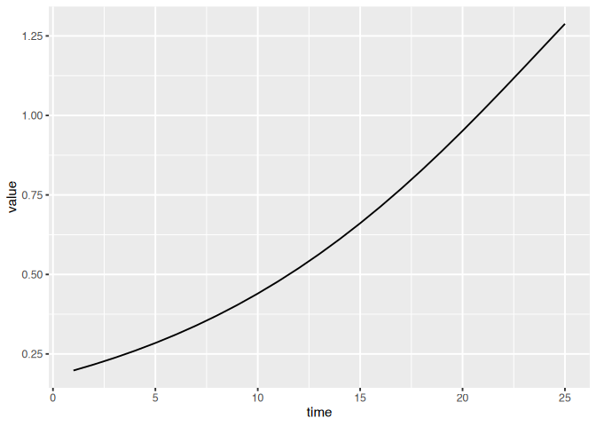
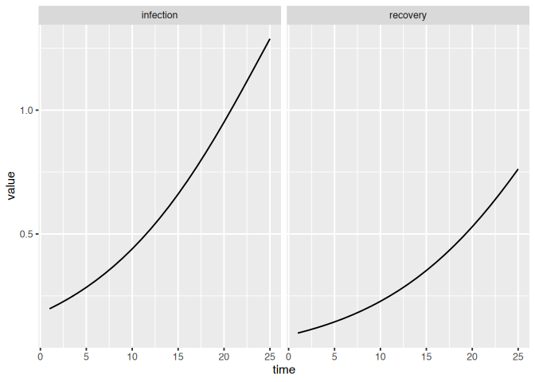
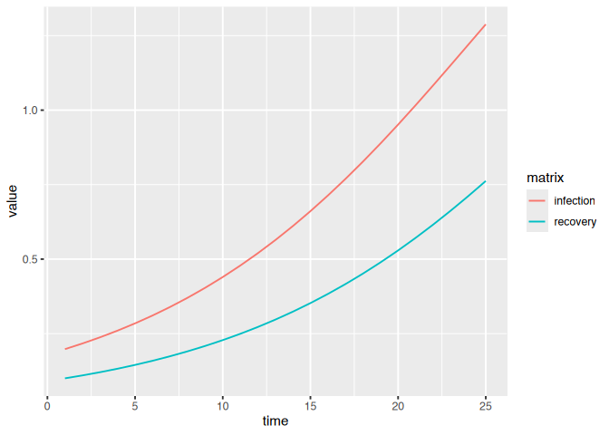

Exploration Exercises
================

# Exploration

## Recipes for Quick-and-Dirty Visualization of Simulations

Simulations from `macpan2` come in a standard format with columns
described
[here](https://canmod.github.io/macpan2/articles/quickstart.html#generating-simulations),
and full documentation
[here](https://canmod.github.io/macpan2/reference/mp_trajectory.html#value).
The key point is that there is always a `time`, `matrix`, and `value`
column. Let’s focus on those. We can use this SIR example.

``` r
library(macpan2); library(tidyverse)
```

    ## ── Attaching core tidyverse packages ────────────────────────────────────────────── tidyverse 2.0.0 ──
    ## ✔ dplyr     1.1.4     ✔ readr     2.1.5
    ## ✔ forcats   1.0.0     ✔ stringr   1.5.1
    ## ✔ ggplot2   3.5.1     ✔ tibble    3.2.1
    ## ✔ lubridate 1.9.3     ✔ tidyr     1.3.1
    ## ✔ purrr     1.0.2     
    ## ── Conflicts ──────────────────────────────────────────────────────────────── tidyverse_conflicts() ──
    ## ✖ dplyr::all_equal() masks macpan2::all_equal()
    ## ✖ dplyr::filter()    masks stats::filter()
    ## ✖ dplyr::lag()       masks stats::lag()
    ## ℹ Use the conflicted package (<http://conflicted.r-lib.org/>) to force all conflicts to become errors

``` r
sir = mp_tmb_library("starter_models", "sir", package = "macpan2")
sim = mp_simulator(sir, time_steps = 25, outputs = "infection")
dat = mp_trajectory(sim)
print(dat)
```

    ##       matrix time row col     value
    ## 1  infection    1   0   0 0.1980000
    ## 2  infection    2   0   0 0.2169692
    ## 3  infection    3   0   0 0.2376233
    ## 4  infection    4   0   0 0.2600847
    ## 5  infection    5   0   0 0.2844793
    ## 6  infection    6   0   0 0.3109346
    ## 7  infection    7   0   0 0.3395786
    ## 8  infection    8   0   0 0.3705380
    ## 9  infection    9   0   0 0.4039349
    ## 10 infection   10   0   0 0.4398849
    ## 11 infection   11   0   0 0.4784928
    ## 12 infection   12   0   0 0.5198490
    ## 13 infection   13   0   0 0.5640248
    ## 14 infection   14   0   0 0.6110669
    ## 15 infection   15   0   0 0.6609922
    ## 16 infection   16   0   0 0.7137807
    ## 17 infection   17   0   0 0.7693697
    ## 18 infection   18   0   0 0.8276464
    ## 19 infection   19   0   0 0.8884416
    ## 20 infection   20   0   0 0.9515225
    ## 21 infection   21   0   0 1.0165878
    ## 22 infection   22   0   0 1.0832626
    ## 23 infection   23   0   0 1.1510954
    ## 24 infection   24   0   0 1.2195575
    ## 25 infection   25   0   0 1.2880447

If we are simulating a single variable, the `matrix` column will be
constant and so we will use recipes like this.

``` r
(dat
  |> ggplot()
  + geom_line(aes(time, value))
)
```

<!-- -->

If we have multiple variables we can use the `matrix` column in our
visualizations to keep track of different variables.

``` r
sim = mp_simulator(sir, time_steps = 25, outputs = mp_flow_vars(sir))
dat = mp_trajectory(sim)
(dat
  |> ggplot()
  + geom_line(aes(time, value))
  + facet_wrap(~matrix)
)
```

<!-- -->

``` r
(dat
  |> ggplot()
  + geom_line(aes(time, value, colour = matrix))
)
```

<!-- -->

## Functional Forms of Flow Rates

We have so far focused on specifying flows with either constant
per-capita rates or mass-action rates. There are a variety of
[mathematical
functions](https://canmod.github.io/macpan2/reference/engine_functions)
that you can use to build more complex functional forms for these rates.

|                                                                                                                                                                                                        |
|:----------------------------------------------------------------------------------------------------------------------------------------------------------------------------------------------------------------------------------------------------|
| Build a simple model with seasonal cycles in transmission. What are some other forms of complexity in the functional forms of rates? Try to implement them. Keep in mind that you can use tilde-based expressions to define intermediate variables. |

## Unbalanced Flows

So far we have used the
[mp_per_capita_flow](https://canmod.github.io/macpan2/reference/mp_per_capita_flow)
function that specifies perfectly balanced flows – the total number out
of the `from` box is equal to the total number into the `to` box. But
processes like birth/death and importation do not behave this way – for
example, birth adds individuals to the `to` box without removing
individuals from the `from` box. Viral shedding into wastewater is
another process that is not a balanced flow. The above linked help page
describes two other kinds of flows that are not balanced.

|                                                                                                                                                                                      |
|:----------------------------------------------------------------------------------------------------------------------------------------------------------------------------------------------------------------------------------|
| Modify one of your models to include birth and death. Allow for the possibility of more birth than death. If your model uses a constant total population size, `N`, you will need to add expressions that update `N` dynamically. |

|       |
|:---------------------------------------------------|
| Add a wastewater compartment to an existing model. |

|                                              |
|:------------------------------------------------------------------------------------------|
| Add a vaccinated compartment to an existing model. How will you model vaccination supply? |

## Relationships Parameters and Simulations

|                                                                                                                                                                                                                                                                                                                                                                                                                                          |
|:--------------------------------------------------------------------------------------------------------------------------------------------------------------------------------------------------------------------------------------------------------------------------------------------------------------------------------------------------------------------------------------------------------------------------------------------------------------------------------------|
| Use the [mp_tmb_calibrator](https://canmod.github.io/macpan2/reference/mp_tmb_calibrator.html) and [mp_trajectory_par](https://canmod.github.io/macpan2/reference/mp_trajectory) functions to plot different trajectories of a single variable in a compartmental model, with each trajectory associated with a change in a model parameter. For example, you could use the SIR model to plot different incidence trajectories for different values of the transmission rate, `beta`. |

|                  |
|:---------------------------------------------------------|
| You will need to loop over a set of beta values somehow. |

## Modifying Model Specifications

|                                                                                                                                                                                             |
|:-----------------------------------------------------------------------------------------------------------------------------------------------------------------------------------------------------------------------------------------|
| Use [mp_tmb_insert](https://canmod.github.io/macpan2/reference/mp_tmb_insert) to reparameterize an existing SIR model specification. Use the relationship that `R0 = beta/gamma` to parameterize the model in terms of `R0` and `gamma`. |

|                                                                                                                                                                                                                                                                                                                                                                                                                                                                                                    |
|:------------------------------------------------------------------------------------------------------------------------------------------------------------------------------------------------------------------------------------------------------------------------------------------------------------------------------------------------------------------------------------------------------------------------------------------------------------------------------------------------------------------------------------------------|
| Create a standard R vector containing as many elements as time steps. Each element gives the value that you want for `R0` at each time. Use [mp_tmb_insert](https://canmod.github.io/macpan2/reference/mp_tmb_insert) to add this vector to the default list. Using this same function, insert an expression at the beginning of the `during` phase that updates `beta` using the appropriate value that the current time step. Note that the output of `x[time_step(1)]` is the value of the vector `x` associated with the current time step. |

|                                                                                                                                                                                  |
|:------------------------------------------------------------------------------------------------------------------------------------------------------------------------------------------------------------------------------|
| Update the SIR model so that it is parameterized in terms of the log of the recovery rate, `gamma`, as opposed to `gamma`. This can be helpful when fitting models to data, because it ensures that `gamma` must be positive. |

## Understand the Math Behind Simulation Models

|                                                                                                                                                                    |
|:----------------------------------------------------------------------------------------------------------------------------------------------------------------------------------------------------------------|
| Explore the functions for [printing out information about model specifications](https://canmod.github.io/macpan2/reference/index.html#unpack-model-specifications) and print out various features of the model. |

|                                                                                                                                                                                                |
|:--------------------------------------------------------------------------------------------------------------------------------------------------------------------------------------------------------------------------------------------|
| Use the [mp_expand](https://canmod.github.io/macpan2/reference/mp_expand.html) function to expand the flows-based form of the SIR model into a more explicit form. Using the output of this function, identify the type of dynamical model? |

# Calibration

## Calibrate to Simulation Data

The first thing you should do when trying a new model fitting technique,
is to see what happens when you fit to data simulated from your model.
Here are data on the number of infectious individuals (or prevalence)
generated by an SIR model.

``` r
simulated_sir = read_csv("https://raw.githubusercontent.com/canmod/macpan-workshop/refs/heads/main/data/simulated-sir.csv")
```

    ## Rows: 100 Columns: 3
    ## ── Column specification ──────────────────────────────────────────────────────────────────────────────
    ## Delimiter: ","
    ## chr (1): matrix
    ## dbl (2): time, value
    ## 
    ## ℹ Use `spec()` to retrieve the full column specification for this data.
    ## ℹ Specify the column types or set `show_col_types = FALSE` to quiet this message.

|                                                                                                                                |
|:----------------------------------------------------------------------------------------------------------------------------------------------------------------------------|
| Calibrate the SIR model to these data generated from the SIR model. Note that the default values of the SIR model have been changed so that this is not a trivial exercise. |

|                                       |
|:------------------------------------------------------------------------------|
| The answers are [here](https://canmod.github.io/macpan2/articles/calibration) |

|                                                                                                                                                                               |
|:---------------------------------------------------------------------------------------------------------------------------------------------------------------------------------------------------------------------------|
| Calibrate to a subset of these data that start after time step 25, to simulate the common problem that we do not get data at the beginning of an epidemic – although you would know more … is surveillance getting better? |

|                                                                |
|:-------------------------------------------------------------------------------------------------------|
| You should use the [mp_sim_offset](https://canmod.github.io/macpan2/reference/mp_sim_offset) function. |

``` r
early_on_covid_reports = read_csv("https://raw.githubusercontent.com/canmod/macpan-workshop/refs/heads/main/data/early_covid_on_reports.csv")
```

    ## Rows: 147 Columns: 4
    ## ── Column specification ──────────────────────────────────────────────────────────────────────────────
    ## Delimiter: ","
    ## chr  (2): province, var
    ## dbl  (1): value
    ## date (1): date
    ## 
    ## ℹ Use `spec()` to retrieve the full column specification for this data.
    ## ℹ Specify the column types or set `show_col_types = FALSE` to quiet this message.

|                                                                                                                                                                                                                                                                                                                                                                                                                                                                                                                                                                                                                                                                                                                 |
|:-------------------------------------------------------------------------------------------------------------------------------------------------------------------------------------------------------------------------------------------------------------------------------------------------------------------------------------------------------------------------------------------------------------------------------------------------------------------------------------------------------------------------------------------------------------------------------------------------------------------------------------------------------------------------------------------------------------------------------------------------------------|
| Modify the SIR model and calibrate it to the initial phase of the `early_on_covid_reports` data. the SIR model to these data generated from the SIR model. You will need to change the names of the variables in the data using the [rename](https://dplyr.tidyverse.org/reference/rename.html) function in the `tidyverse`. Note that you will need to update the default values to be more suitable for Ontario. For example, the population of Ontario is about 14 million. You might want to modify other values. What other modifications could you make to the model to fit better? This is meant to be a challenge. My imperfect answer is [here](https://github.com/canmod/macpan-workshop/blob/main/code/initial-fit-covid.R), but try not to look. |

# Inference

## Visualize Goodness-of-Fit

Here are some `ggplot2` recipes for visualizing goodness-of-fit. If you
had a fitted calibrator called `model_calibrator` that were fitted to
`observed_data`, you can use this recipe (not run).

``` r
fitted_data = mp_trajectory(model_calibrator)
(ggplot()
  + geom_point(aes(time, value), data = observed_data)
  + geom_line(aes(time, value), data = fitted_data)
  + theme_bw()
)
```

If you would like to visualize uncertainty around this fitted
trajectory, you can use the `geom_ribbon` function in `ggplot2`.

``` r
fitted_data = mp_trajectory_sd(model_calibrator, conf.int = TRUE)
(ggplot()
  + geom_point(aes(time, value), data = observed_data)
  + geom_line(aes(time, value), data = fitted_data)
  + geom_ribbon(aes(time, ymax = conf.high, ymin = conf.low), data = fitted_data)
  + theme_bw()
)
```

## Confidence Intervals for Estimated Parameters

|                                                                                                                                                                                                                                                                                                                                                                                                                                                                                        |
|:------------------------------------------------------------------------------------------------------------------------------------------------------------------------------------------------------------------------------------------------------------------------------------------------------------------------------------------------------------------------------------------------------------------------------------------------------------------------------------------------------------------------------------|
| For one of your calibrated models, use the [mp_tmb_coef](https://canmod.github.io/macpan2/reference/mp_tmb_coef.html) function to get parameter estimates with confidence intervals.                                                                                                                                                                                                                                                                                                                                                |
| Note that you will need to use `conf.int = TRUE` option that is a little hidden in the documentation, but it is there. Did any of your parameters have an interval that overlaps zero? If so try to fix this by fitting the log transformed version of the offending parameter. If you call the log of your parameter `log_{name-of-parameter}`, the confidence intervals will be automatically back-transformed to the original scale and will not overlap zero. Did you get any NaNs (not a number)? This is a sign of a bad fit. |

## Forecasts and Scenarios

Let’s keep it simple again and get more practice simulating and fitting.
You can use this calibrated model to practice making forecasts and
exploring scenarios.

``` r
exercise(
    "Simulate 50 time steps of incidence (i.e., the infection flow) from the SIR model in the library with defaults. Create a calibrator but change the default values of `beta` and `gamma` so that the optimizer will need to do work to find the true values. Then calibrate your model to the simulation data using [mp_optimize](https://canmod.github.io/macpan2/reference/mp_optimize.html). After optimizing use [mp_forecaster](https://canmod.github.io/macpan2/reference/mp_forecaster) to extend 50 more time steps, so that the entire simulation would be 100 time steps. Use [mp_trajectory_sd](https://canmod.github.io/macpan2/reference/mp_trajectory.html) to produce forecasts with confidence intervals."
)
```

|                                                                                                                                                                                                                                                                                                                                                                                                                                                                                                                                                                                                                                                                             |
|:-------------------------------------------------------------------------------------------------------------------------------------------------------------------------------------------------------------------------------------------------------------------------------------------------------------------------------------------------------------------------------------------------------------------------------------------------------------------------------------------------------------------------------------------------------------------------------------------------------------------------------------------------------------------------------------------------------------------------|
| Simulate 50 time steps of incidence (i.e., the infection flow) from the SIR model in the library with defaults. Create a calibrator but change the default values of `beta` and `gamma` so that the optimizer will need to do work to find the true values. Then calibrate your model to the simulation data using [mp_optimize](https://canmod.github.io/macpan2/reference/mp_optimize.html). After optimizing use [mp_forecaster](https://canmod.github.io/macpan2/reference/mp_forecaster) to extend 50 more time steps, so that the entire simulation would be 100 time steps. Use [mp_trajectory_sd](https://canmod.github.io/macpan2/reference/mp_trajectory.html) to produce forecasts with confidence intervals. |

``` r
exercise(
    "Create a scenario for beta, where transmission increases by a factor of 1.2 at time 60 (10 time steps after the data end). The answers for this exercise are [here](https://github.com/canmod/macpan-workshop/blob/main/code/simple-scenario.R)."
)
```

|                                                                                                                                                                                                     |
|:-------------------------------------------------------------------------------------------------------------------------------------------------------------------------------------------------------------------------------------------------|
| Create a scenario for beta, where transmission increases by a factor of 1.2 at time 60 (10 time steps after the data end). The answers for this exercise are [here](https://github.com/canmod/macpan-workshop/blob/main/code/simple-scenario.R). |
