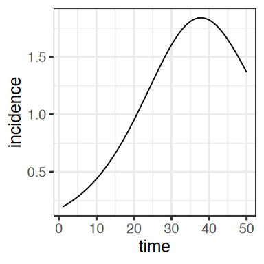

Technical Preparation
================

This document outlines the steps required to prepare your computer for
the [`macpan2`](https://canmod.github.io/macpan2/) workshop.

<!-- omit from toc -->

## Table of Contents

-   [The Most Important Things](#the-most-important-things)
-   [Installing a Sufficiently Recent Version of
    R](#installing-a-sufficiently-recent-version-of-r)
-   [Installing Supporting R
    Packages](#installing-supporting-r-packages)
-   [Installing `macpan2`](#installing-macpan2)
-   [Verify that Everything Worked](#verify-that-everything-worked)

## The Most Important Things

If you have any difficulties or questions about the technical
instructions below, please contact [Steve
Walker](mailto:swalk@mcmaster.ca) (the instructor) as soon as possible
so that we can focus on the material during the workshop without
technical distractions.

Ideally, you should be able to install open-source software from the
internet both before and during the workshop. If this is not possible,
please contact [Steve](mailto:swalk@mcmaster.ca) as soon as possible.

Everything we do in the workshop will involve
[R](https://www.r-project.org/). If you do not use R, please email
[Steve](mailto:swalk@mcmaster.ca) and briefly describe your coding
background.

## Installing a Sufficiently Recent Version of R

If you are familiar with [R](https://www.r-project.org/) and already
have it installed, ensure that you have a sufficiently recent version.
To check, start R and print the version using the following command:

``` r
print(R.version.string)
```

    ## [1] "R version 4.4.2 (2024-10-31)"

This shows that I am using R version 4.4.2 (2024-10-31). The version you
get will likely be different. You need R version `4.3.0` or newer. If
your version is too old, please install the latest version of R by
following the instructions [here](https://cran.rstudio.com/).

If you do not have R installed, I recommend following the installation
instructions for [RStudio](https://posit.co/download/rstudio-desktop/).
These instructions guide you through installing
[R](https://cran.rstudio.com/) first, followed by RStudio, which is the
program I will use to interact with R during the workshop.

You are welcome to use R without RStudio but, unless you have a strong
preference, I recommend using RStudio.

## Installing Supporting R Packages

The [`macpan2`](https://canmod.github.io/macpan2/) package is designed
to be used alongside a collection of packages known as the
[tidyverse](https://www.tidyverse.org/). To install these packages,
along with an additional package we will be using, open R and run the
following command:

``` r
install.packages(c("tidyverse", "broom.mixed"))
```

## Installing `macpan2`

To install [`macpan2`](https://canmod.github.io/macpan2/), please run
the following commands in R:

``` r
repos = c('https://canmod.r-universe.dev', 'https://cloud.r-project.org')
install.packages('macpan2', repos = repos)
```

If this command fails, try:

```r
repos = c('https://canmod.r-universe.dev', 'https://cloud.r-project.org')
install.packages('macpan2', repos = repos, type = "binary")
```

## Verify that Everything Worked

First, ensure that the packages load without errors. Run the following
command in R and check that you receive a similar report about loaded
packages. The output does not need to be identical, but it should be
free of errors.

``` r
library(macpan2); library(tidyverse)
```

    ## ── Attaching core tidyverse packages ───────────────────────────────────────────── tidyverse 2.0.0 ──
    ## ✔ dplyr     1.1.4     ✔ readr     2.1.5
    ## ✔ forcats   1.0.0     ✔ stringr   1.5.1
    ## ✔ ggplot2   3.5.1     ✔ tibble    3.2.1
    ## ✔ lubridate 1.9.3     ✔ tidyr     1.3.1
    ## ✔ purrr     1.0.2     
    ## ── Conflicts ─────────────────────────────────────────────────────────────── tidyverse_conflicts() ──
    ## ✖ dplyr::all_equal() masks macpan2::all_equal()
    ## ✖ dplyr::filter()    masks stats::filter()
    ## ✖ dplyr::lag()       masks stats::lag()
    ## ℹ Use the conflicted package (<http://conflicted.r-lib.org/>) to force all conflicts to become errors

To fully verify that everything is set up correctly, copy and paste the
following lines of code into R to simulate an SIR model. Ensure that the
output matches the graph shown below.

``` r
("starter_models"
 |> mp_tmb_library("sir", package = "macpan2")
 |> mp_simulator(time_steps = 50, outputs = "infection")
 |> mp_trajectory()
 |> mutate(incidence = value)
 |> ggplot() 
 + geom_line(aes(time, incidence))
 + theme_bw()
)
```

<!-- -->
